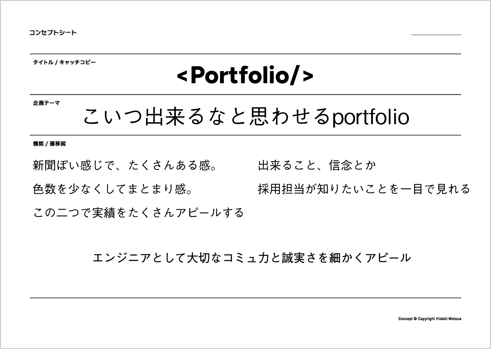
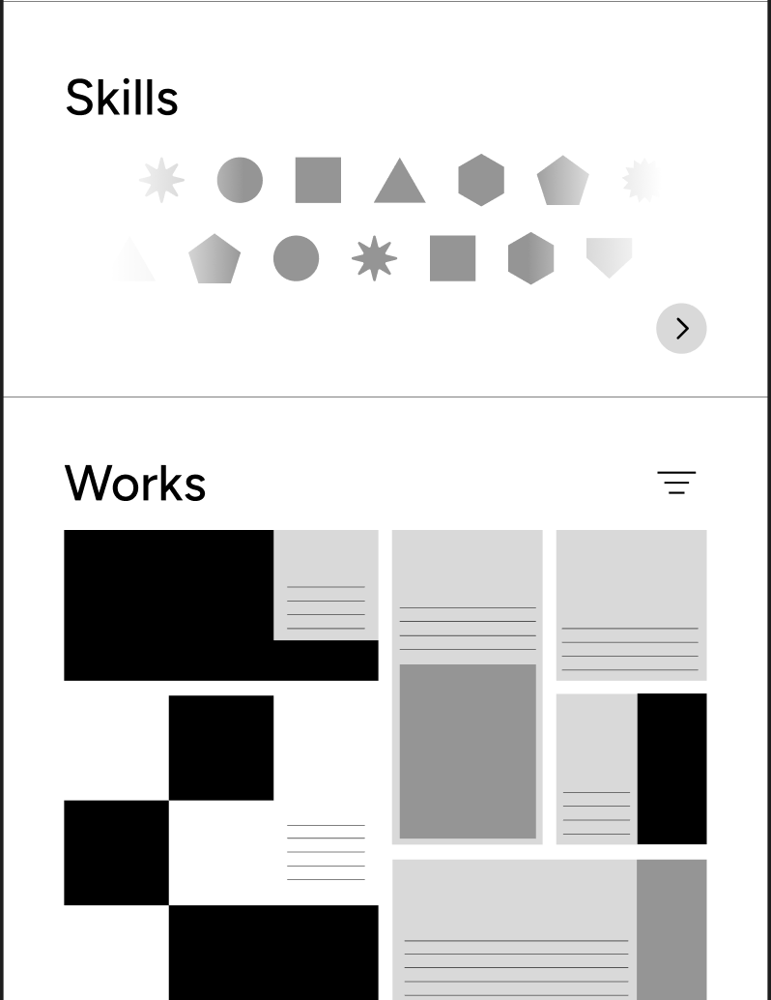

高専に入学してからの取り組みをまとめたポートフォリオを作成しました。

このポートフォリオは、採用やインターン先に渡すことに重点を置いて設計しました。コンセプトの推敲を重ね、実績の数や信念が伝わるレイアウト、デザインを考えました。

## 新聞から、商品棚へ

デザインは、新聞などをイメージした白黒ベース。異なる情報やテーマが隣り合うことで、多才さを表現しようとしました。

しかし、このようなデザインは統一感が薄れ、読みづらくなる課題がありました。そこから、現在のグリッドをベースとした商品棚のようなデザインを採用しました。

[作品ページでデザインの変遷を見る](/works/portfolio/)
