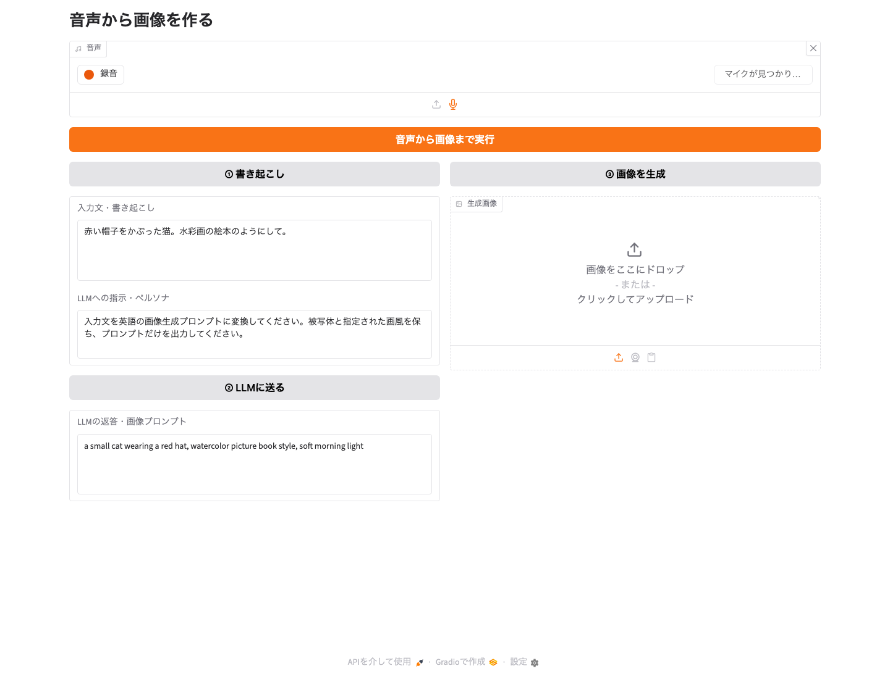
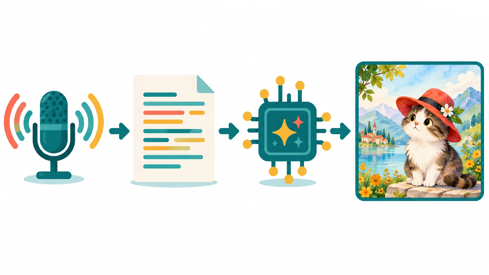

話した内容から画像を作る、小さなAIアプリを作ります。


*声から画像を作るワークショップの完成イメージ。画像生成AIで作成しました。*

最初から全部を組み合わせるのではなく、文章生成、音声認識、画像生成を一つずつ動かします。

最後に三つの機能をつなぎ、マイクに向かって話すだけで画像が完成するアプリにします。

完成したあとは、指示文や画面を自由に変えて、自分だけのアプリへ改造します。



*完成版のコードをGradio 6.28.0で表示した画面。画像はまだ生成していない状態です。*

## このワークショップで作るもの

完成するアプリは、次の順番で動きます。

1. マイクで作りたい画像を説明する
2. Whisperが音声を文字にする
3. Qwenが文章を画像生成用の英語プロンプトに変える
4. Z-Imageがプロンプトから画像を作る



*音声から画像までの流れ。画像生成AIで作成したイメージ図です。*

三つのAIは、それぞれ別の仕事を担当します。

| AI | このアプリでの役割 | 入力 | 出力 |
| --- | --- | --- | --- |
| Whisper | 音声認識 | 音声 | 文字 |
| Qwen3-4B-Instruct-2507 | 文章生成 | 日本語の説明と指示 | 英語のプロンプト |
| Z-Image-Turbo | 画像生成 | 英語のプロンプト | 画像 |

画面は**Gradio**というPythonライブラリで作ります。


*出典：[Gradio公式サイト](https://www.gradio.app/)*

Gradioには、マイク、テキスト入力、ボタン、画像表示などの部品が用意されています。

そのため、画面を一から設計するよりも、AIへ何を入力し、どんな結果を返すかに集中できます。

## 到達目標

この演習を終えると、次のことができるようになります。

- `uv`を使ってPythonプロジェクトとライブラリを管理できる
- Gradioで入力、ボタン、出力を持つ画面を作れる
- `httpx`を使ってWeb APIへデータを送れる
- 文章生成、音声認識、画像生成の違いを説明できる
- 複数のAIを、前の出力を次の入力にしてつなげられる
- 指示文や画面の部品を変えて、アプリを改造できる

## 今日使うAI

今回はAIの歴史や学習方法を詳しく扱うのではなく、性質の違うAIを組み合わせて一つのアプリを作ります。

### Whisper

**Whisper**は、OpenAIが公開した音声認識モデルです。

音声を同じ言語の文字へ書き起こすほか、言語の判定や英語への翻訳にも対応しています。

今回は、日本語で話した音声を日本語の文字へ変換するために使います。

### Qwen3-4B-Instruct-2507

**Qwen3-4B-Instruct-2507**は、Qwenチームが公開している40億パラメータの言語モデルです。

質問への回答、文章の変換、指示に沿った文章生成などを行えます。

今回は、日本語で書かれた画像の説明を、画像生成AIが扱いやすい英語のプロンプトへ変換します。

### Z-Image-Turbo

**Z-Image-Turbo**は、Z-Imageチームが公開している画像生成モデルです。

短い処理手順で画像を生成でき、写実的な表現や英語と中国語の文字表現を得意としています。

今回は、Qwenが作った英語のプロンプトから画像を生成します。

> **AIの答えは毎回同じとは限りません。**  
> 同じ文章を送っても、言語モデルの返答や生成画像が変わることがあります。  
> AIの出力は完成品ではなく、確認して直すための候補として扱います。

## 準備するもの

- インターネットに接続できるパソコン
- ChromeなどのWebブラウザ
- VS Codeなどのテキストエディタ
- ターミナル
- マイク
- Pythonプロジェクト管理ツールの`uv`

この教材のAPI URLはワークショップ用です。

授業後に停止したり、URLが変わったりする可能性があります。

## プロジェクトを作成する

### uvを確認する

ターミナルを開き、次のコマンドを実行します。

```bash
uv --version
```

バージョン番号が表示されれば準備できています。

`command not found`と表示された場合は、講師の案内に従って`uv`をインストールしてください。

macOSでHomebrewを使える場合は、次のコマンドでもインストールできます。

```bash
brew install uv
```

### 作業用フォルダを作る

作業したい場所へ移動します。

たとえば、デスクトップに作る場合は次のように入力します。

```bash
cd ~/Desktop
```

プロジェクトを作成し、そのフォルダへ移動します。

```bash
uv init voice-image-workshop
cd voice-image-workshop
```

必要なライブラリを追加します。

```bash
uv add gradio==6.28.0 httpx pillow
```

このコマンドで、Gradio、HTTP通信に使う`httpx`、画像を扱う`Pillow`がプロジェクトへ追加されます。

`uv.lock`には、実際に使うライブラリのバージョンが記録されます。

同じプロジェクトを別のパソコンで開いたときも、環境を再現しやすくなります。

## 演習1 文章生成AIと話す

最初はQwenだけを使います。

指示と入力文を送ると、AIの返答が表示されるアプリを作ります。

### ファイルを作る

プロジェクトの中に`llm.py`を作り、次のコードを入力します。

<details class="article-accordion">
<summary>llm.py のコード全体を見る</summary>

```python
import gradio as gr
import httpx

API = "https://capture-marco-sphere-dubai.trycloudflare.com"


def generate(instruction, text):
    r = httpx.post(
        f"{API}/llm",
        json={"instruction": instruction, "text": text},
        timeout=300,
    )
    r.raise_for_status()
    return r.json()["text"]


demo = gr.Interface(
    fn=generate,
    inputs=[
        gr.Textbox(
            label="指示・ペルソナ",
            value=(
                "あなたは猫です。"
                "日本語で語尾に『にゃん』とつけて答えてください。"
            ),
            lines=3,
        ),
        gr.Textbox(label="入力文", lines=3),
    ],
    outputs=gr.Textbox(label="返答"),
    title="Qwen",
)

demo.launch()
```

</details>

### 実行して確認する

ターミナルで次のコマンドを実行します。

```bash
uv run llm.py
```

ターミナルに表示された`http://127.0.0.1:7860`をブラウザで開きます。

入力文に「今日のおすすめの遊びを教えて」と入力し、送信します。

返答の語尾に「にゃん」が付けば成功です。

アプリを止めるときは、ターミナルで`Control + C`を押します。

### コードの仕組み

`generate`関数は、画面に入力された二つの文章を受け取ります。

```python
def generate(instruction, text):
```

`instruction`はAIの役割や出力方法を決める指示です。

`text`は、AIに処理してほしい本文です。

次の部分で、二つの文章をワークショップ用APIへ送ります。

```python
r = httpx.post(
    f"{API}/llm",
    json={"instruction": instruction, "text": text},
    timeout=300,
)
```

APIから返ったJSONのうち、`text`に入っている文章を画面へ返します。

```python
return r.json()["text"]
```

`gr.Interface`は、一つのPython関数を入力欄と出力欄につなぐ部品です。

この例では、送信ボタンを押すと`generate`関数が実行されます。

### 指示を変えてみる

「指示・ペルソナ」を変えると、同じ入力文でも返答が変わります。

たとえば、次の指示を試せます。

```text
小学生にもわかる言葉で、3文以内で説明してください。
```

```text
あなたは徳島県の観光案内役です。場所を一つ選び、見どころを説明してください。
```

指示文はAIそのものを書き換えているわけではありません。

同じAIに、その場で担当してほしい役割と答え方を伝えています。

## 演習2 音声を文字にする

次にWhisperを使います。

マイクで録音した音声、または音声ファイルを送ると、書き起こしが表示されるアプリを作ります。

### ファイルを作る

`stt.py`を作り、次のコードを入力します。

<details class="article-accordion">
<summary>stt.py のコード全体を見る</summary>

```python
import gradio as gr
import httpx

API = "https://capture-marco-sphere-dubai.trycloudflare.com"


def transcribe(audio_path):
    if audio_path is None:
        raise gr.Error("音声を録音するか、ファイルを選んでください")

    with open(audio_path, "rb") as audio:
        r = httpx.post(
            f"{API}/asr",
            files={"file": ("audio.wav", audio)},
            timeout=300,
        )
    r.raise_for_status()
    return r.json()["text"]


demo = gr.Interface(
    fn=transcribe,
    inputs=gr.Audio(
        sources=["microphone", "upload"],
        type="filepath",
        format="wav",
        label="音声",
    ),
    outputs=gr.Textbox(label="書き起こし"),
    title="Whisper",
)

demo.launch()
```

</details>

### 実行して確認する

```bash
uv run stt.py
```

ブラウザでマイクの使用を求められたら許可します。

「赤い帽子をかぶった猫」と話して録音し、送信します。

話した内容が文字で表示されれば成功です。

### コードの仕組み

Gradioの`Audio`部品へ録音すると、一時的な音声ファイルの場所が`audio_path`へ渡されます。

```python
def transcribe(audio_path):
```

音声が選ばれていない場合は、処理を始めずにエラーメッセージを表示します。

```python
if audio_path is None:
    raise gr.Error("音声を録音するか、ファイルを選んでください")
```

次の部分では音声ファイルをバイナリ形式で開き、`/asr`へ送っています。

```python
with open(audio_path, "rb") as audio:
    r = httpx.post(
        f"{API}/asr",
        files={"file": ("audio.wav", audio)},
        timeout=300,
    )
```

音声認識は、固有名詞、早口、周囲の雑音などによって間違えることがあります。

短く区切り、マイクへ近づいて話すと認識しやすくなります。

## 演習3 文章から画像を作る

次にZ-Image-Turboを使います。

テキスト欄へプロンプトを入力すると、生成画像が表示されるアプリを作ります。

### ファイルを作る

`image.py`を作り、次のコードを入力します。

<details class="article-accordion">
<summary>image.py のコード全体を見る</summary>

```python
import io

import gradio as gr
import httpx
from PIL import Image

API = "https://capture-marco-sphere-dubai.trycloudflare.com"


def generate(prompt):
    r = httpx.post(
        f"{API}/image",
        json={"prompt": prompt},
        timeout=300,
    )
    r.raise_for_status()
    return Image.open(io.BytesIO(r.content)).convert("RGB")


demo = gr.Interface(
    fn=generate,
    inputs=gr.Textbox(
        label="画像プロンプト",
        value="a cat wearing a red hat",
    ),
    outputs=gr.Image(label="生成画像"),
    title="Z-Image",
)

demo.launch()
```

</details>

### 実行して確認する

```bash
uv run image.py
```

最初から入力されている次のプロンプトを送信します。

```text
a cat wearing a red hat
```

赤い帽子をかぶった猫の画像が表示されれば成功です。

### コードの仕組み

プロンプトはJSONとして`/image`へ送ります。

```python
r = httpx.post(
    f"{API}/image",
    json={"prompt": prompt},
    timeout=300,
)
```

画像APIの返答は文章ではなく、画像ファイルのバイト列です。

`Pillow`の`Image.open`で画像として開き、Gradioへ返します。

```python
return Image.open(io.BytesIO(r.content)).convert("RGB")
```

### プロンプトを詳しくする

生成される画像は、プロンプトの具体さによって変わります。

まず、短いプロンプトを試します。

```text
a cat
```

次に、被写体、画風、場所、光を追加します。

```text
a small cat wearing a red hat, watercolor picture book style,
in a flower garden, soft morning light
```

プロンプトを考えるときは、次の四つに分けると書きやすくなります。

| 要素 | 例 |
| --- | --- |
| 被写体 | a small cat wearing a red hat |
| 場所 | in a flower garden |
| 画風 | watercolor picture book style |
| 光や雰囲気 | soft morning light |

日本語と英語で同じ内容を送り、結果を比べてみても構いません。

言語を変えると、翻訳の違いだけでなく、モデルが学習した画像と文章の偏りによって、構図や雰囲気が変わることがあります。

一回の結果だけで「日本語は苦手」「英語なら正しい」と決めず、何回か生成して比べます。

## 演習4 三つのAIをつなぐ

ここまでに作った三つの機能を、一つの画面へまとめます。

マイクの音声は、次のように順番に受け渡されます。

**録音 → Whisperで書き起こし → 内容を確認して編集 → Qwenで英語プロンプトへ変換 → Z-Imageで画像生成**

途中の文章を画面に表示するため、AIが何を受け取り、何を返したのかを確認できます。

### ファイルを作る

`demo.py`を作り、次のコードを入力します。

<details class="article-accordion">
<summary>demo.py のコード全体を見る</summary>

```python
import io

import gradio as gr
import httpx
from PIL import Image

API = "https://capture-marco-sphere-dubai.trycloudflare.com"


def transcribe(audio_path):
    if audio_path is None:
        raise gr.Error("音声を録音するか、アップロードしてください")

    with open(audio_path, "rb") as audio:
        r = httpx.post(
            f"{API}/asr",
            files={"file": ("audio.wav", audio)},
            timeout=300,
        )
    r.raise_for_status()
    return r.json()["text"]


def run_llm(instruction, text):
    r = httpx.post(
        f"{API}/llm",
        json={"instruction": instruction, "text": text},
        timeout=300,
    )
    r.raise_for_status()
    return r.json()["text"]


def generate_image(prompt):
    r = httpx.post(
        f"{API}/image",
        json={"prompt": prompt},
        timeout=300,
    )
    r.raise_for_status()
    return Image.open(io.BytesIO(r.content)).convert("RGB")


with gr.Blocks() as demo:
    gr.Markdown("# 音声から画像を作る")

    audio = gr.Audio(
        sources=["microphone", "upload"],
        type="filepath",
        format="wav",
        label="音声",
    )

    all_button = gr.Button("音声から画像まで実行", variant="primary")

    with gr.Row():
        with gr.Column():
            asr_button = gr.Button("① 書き起こし")
            text = gr.Textbox(label="入力文・書き起こし", lines=4)

            instruction = gr.Textbox(
                label="LLMへの指示・ペルソナ",
                value=(
                    "入力文を英語の画像生成プロンプトに変換してください。"
                    "被写体と指定された画風を保ち、"
                    "プロンプトだけを出力してください。"
                ),
                lines=3,
            )
            llm_button = gr.Button("② LLMに送る")
            result = gr.Textbox(
                label="LLMの返答・画像プロンプト",
                lines=4,
            )

        with gr.Column():
            image_button = gr.Button("③ 画像を生成")
            image = gr.Image(label="生成画像")

    asr_button.click(transcribe, inputs=audio, outputs=text)
    llm_button.click(
        run_llm,
        inputs=[instruction, text],
        outputs=result,
    )
    image_button.click(generate_image, inputs=result, outputs=image)

    all_button.click(
        transcribe,
        inputs=audio,
        outputs=text,
    ).success(
        run_llm,
        inputs=[instruction, text],
        outputs=result,
    ).success(
        generate_image,
        inputs=result,
        outputs=image,
    )

demo.launch()
```

</details>

### 実行して確認する

```bash
uv run demo.py
```

次の内容をマイクへ話してみます。

```text
赤い帽子をかぶった猫。水彩画の絵本のようにして。
```

まずは三つのボタンを順番に押します。

1. 「① 書き起こし」で、音声が正しく文字になったか確認する
2. 必要なら書き起こしを編集する
3. 「② LLMに送る」で、英語のプロンプトを確認する
4. 「③ 画像を生成」で、画像を作る

一つずつ成功したら、「音声から画像まで実行」ボタンも試します。

### 三つの処理をつなぐ仕組み

各段階のボタンは、それぞれ一つの関数を実行します。

```python
asr_button.click(transcribe, inputs=audio, outputs=text)
```

これは、「ボタンを押したら`audio`を`transcribe`へ渡し、結果を`text`へ表示する」という意味です。

一括実行では、`.success`を使って処理をつなぎます。

```python
all_button.click(
    transcribe, inputs=audio, outputs=text
).success(
    run_llm, inputs=[instruction, text], outputs=result
).success(
    generate_image, inputs=result, outputs=image
)
```

前の処理が成功したときだけ、次の処理へ進みます。

音声認識に失敗したのに、空の文章から画像生成まで進んでしまうことを防げます。

## 自分のアプリへ改造する

ここからは完成コードを写すのではなく、作りたいものに合わせて変更します。

一度に多くの場所を変えると、エラーの原因を見つけにくくなります。

一つ変更したら実行し、動いたことを確認してから次へ進みます。

### 改造案1 画風を選べるようにする

水彩、写真、ピクセルアートなどを選ぶ欄を追加します。

`instruction`へ画風を入力する方法でも、`gr.Dropdown`を追加する方法でも構いません。

### 改造案2 役割を変える

Qwenへの指示を変えると、プロンプトの作り方を変えられます。

- 絵本作家
- ゲームのキャラクターデザイナー
- 観光ポスターのデザイナー
- 映画の美術監督

役割だけでなく、「何を残すか」「何だけを出力するか」も指示します。

### 改造案3 書き起こしを直してから生成する

現在の完成版でも、書き起こし欄を直接編集できます。

固有名詞や聞き間違いを直してからQwenへ送ると、意図に近い画像を作りやすくなります。

一括実行だけにせず、途中結果を確認できる設計にはこの利点があります。

### 改造案4 生成結果を比較する

同じ内容で、次のどれか一つだけを変えて画像を生成します。

- 日本語と英語
- 短い説明と詳しい説明
- 水彩と写真
- 朝と夜
- 楽しい雰囲気と不気味な雰囲気

何を変えたときに、画像のどこが変わったかを記録します。

### AIに改造を手伝ってもらう

ChatGPTやCodexへ質問しても構いません。

そのときは、次の三つを一緒に伝えると状況が伝わりやすくなります。

1. 作りたい動き
2. 現在のコード
3. 表示されたエラーメッセージ

たとえば、次のように質問できます。

```text
このGradioアプリに、水彩、写真、ピクセルアートを選べる欄を追加したいです。
選んだ画風を画像プロンプトへ追加するように、変更箇所を説明してください。
現在のコードは次の通りです。
```

AIが提案したコードも、そのまま正しいとは限りません。

どこが変わったかを確認し、一つずつ実行します。

## うまく動かないとき

### `uv: command not found`と表示される

`uv`がインストールされていないか、インストール後のターミナルを開き直していない可能性があります。

講師へ確認し、インストール後に新しいターミナルで`uv --version`を実行します。

### ブラウザでマイクを使えない

アドレスバー付近のマイク権限を確認します。

一度拒否した場合は、権限を許可してからページを再読み込みします。

### `ConnectionError`やタイムアウトが表示される

インターネット接続、API URL、ワークショップ用サーバーの状態を確認します。

画像生成には文章生成より時間がかかることがあります。

### `HTTPStatusError`が表示される

APIがエラーを返しています。

入力を短くしてもう一度試し、それでも続く場合は講師へエラー全文を見せます。

### Pythonのエラーが表示される

エラーの最後の数行には、ファイル名、行番号、原因が書かれています。

特に、括弧、引用符、インデントを見本と比べます。

## 見せ合うときのポイント

完成したアプリを見せるときは、生成画像だけでなく、次の点も共有します。

- 何を作ろうとしたか
- どの指示や画面を変えたか
- 予想と違った結果
- 次にもう一つ直すなら何を変えるか

同じAIを使っても、指示と組み合わせ方によって違うアプリになります。

ほかの人の作品を見て、使ってみたい工夫を一つ見つけてください。

## 参考資料

- [Z-Image公式リポジトリ](https://github.com/Tongyi-MAI/Z-Image)
- [Qwen3-4B-Instruct-2507公式モデルカード](https://huggingface.co/Qwen/Qwen3-4B-Instruct-2507)
- [Whisper公式リポジトリ](https://github.com/openai/whisper)
- [uv公式インストールガイド](https://docs.astral.sh/uv/getting-started/installation/)

## おわりに

このアプリでは、三つのAIを一から学習させていません。

すでに役割の異なるAIをAPIで呼び出し、入出力をつなぐことで、新しい体験を作りました。

AIアプリを作るときは、最初から大きな完成品を目指す必要はありません。

一つの機能を動かし、確認し、次の機能を足す。

この繰り返しで、短いPythonコードからでも自分のアイデアを形にできます。
